# projet2

# Solutions

## Exercice 1

1. gh repo create: cette commande m'a servi à créer un dépot git-learning-1.

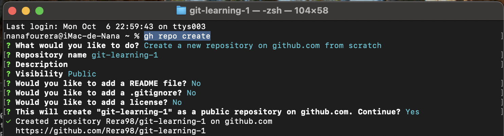

2. git clone https://github.com/Rera98/git-learning-1.git: permet de clonner mon repo git-learning-1.

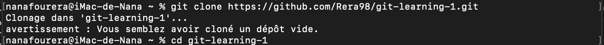

3. echo Mon premier projet Git > README.md: permet de créer et d'afficher en même temps du texte dans le fichier README.
4. echo Zabeirou Yacouba >> README.md: permet d'ajouter une autre ligne dans le fichier README
5. git add .: permet de préparer tous les fichiers modifiés pour le prochain commit.
6. git commit -m "commit": permet de sauvegarder dans l'historique git les fichiers déjà préparer.
7. git push origin main: envoie les commits locaux vers le dépot distant Github.

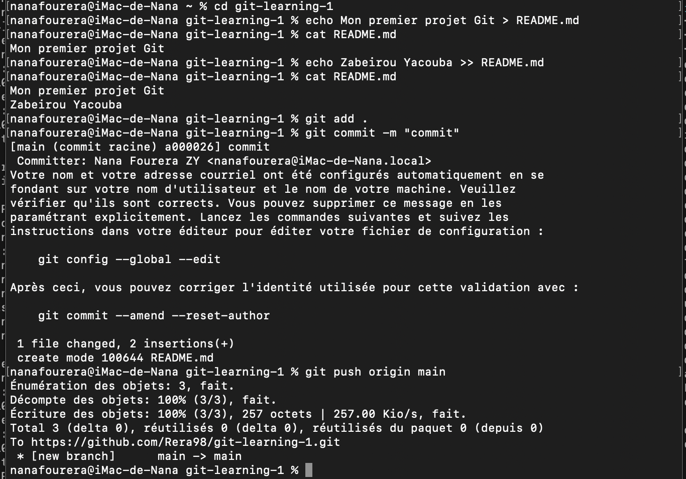

## Exercice 2

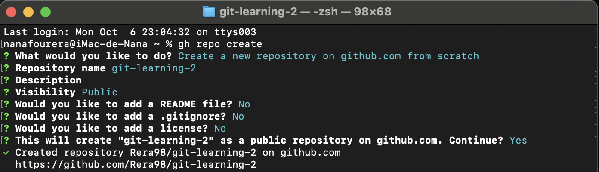

1. git branch myself: permet de creer une nouvelle branche.
2. git branch: permet de voir les branches existantes dans le repo.
3. git checkout myself: permet de basculer sur la branche myself.
4. touch about.txt: permet de creer le fichier about.txt.
5. echo Zabeirou Nana Fourera Niamey > about.tx: permet d'ecrire le texte Zabeirou Nana Fourera Niamey dans le fichier about.txt.

  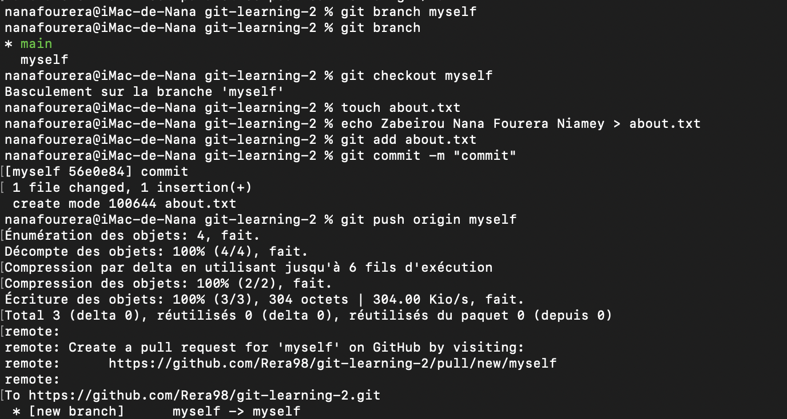

7. gh pr create --base main --head myself --title "Fusion" --body "modifications." : Cette commande crée une pull request sur GitHub pour demander à fusionner la branche myself dans la branche main.
8. git switch main: permet de basculer sur la branche main
9. git pull origin main: permet de mettre à jour ma branche main locale.
10. git merge myself: permet de fusionner la branche myself avec la branche courante.

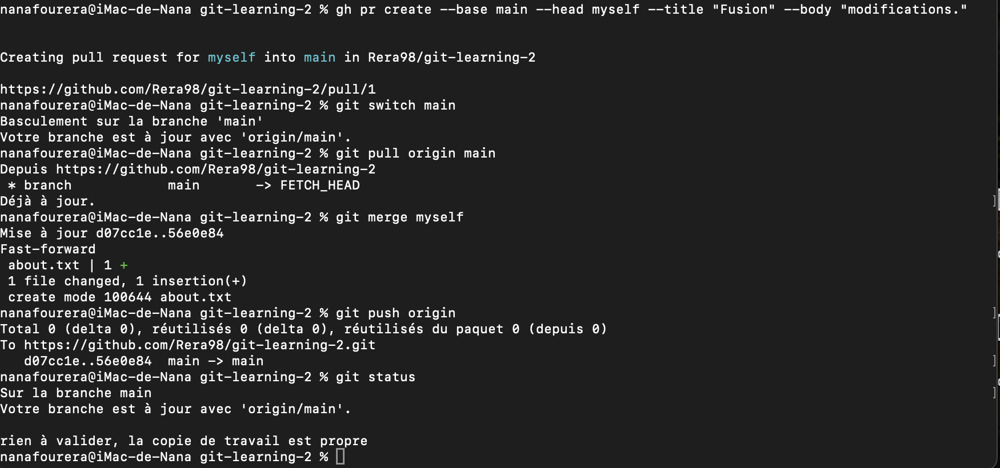

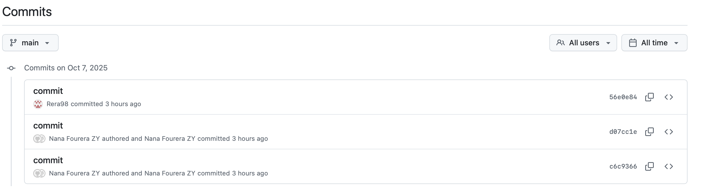

## Exercice 3

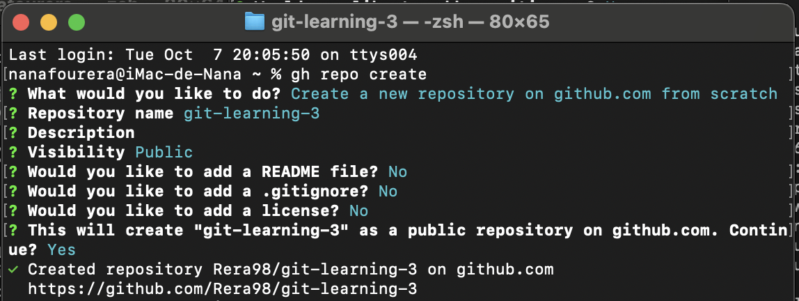

1. echo Ligne écrite depuis la branche main > notes.txt: permet d'ecrire Ligne écrite depuis la branche main dans le fichier notes.txt.
2. git branch -M main: permet de renommer la branche actuelle en main même si une branche main existait déjà elle sera écrasée.

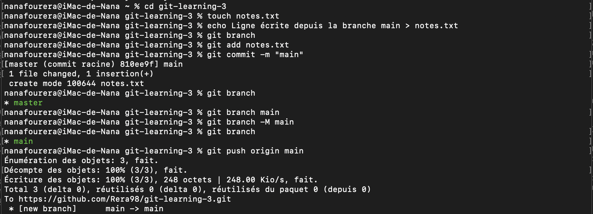

4. git branch conflict-test: permet de creer la branche conflict-test.
5. git checkout conflict-test: permet de basculer sur la branche conflict-test.
7. echo Ligne écrite depuis la branche conflict-test >> notes.txt: permet d'ajouter Ligne écrite depuis la branche conflict-test dans le fichier notes.txt sans ecraser son contenu.

   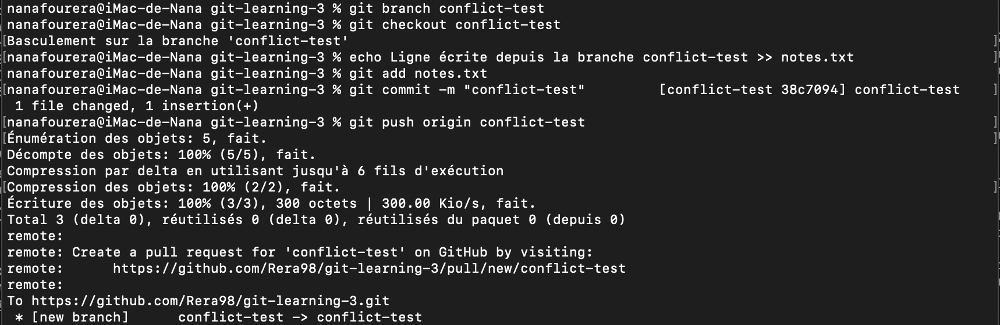

   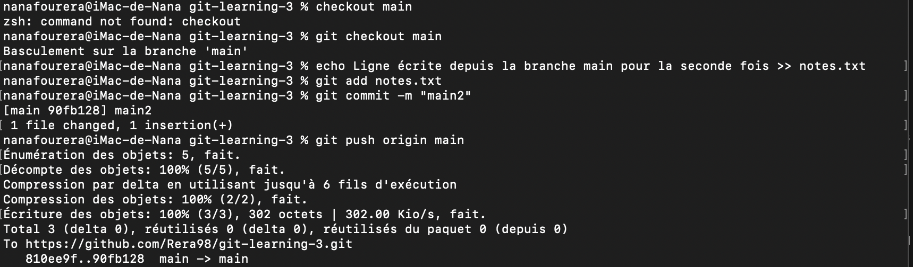
   
9. git merge conflict-test: permet la fusion entre la branche conflict-test et la branche courante.
10. nanonano notes.txt: permet d'ouvrire le fichier nano notes.txt.

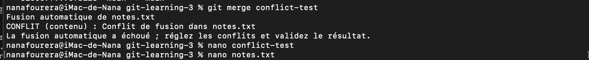

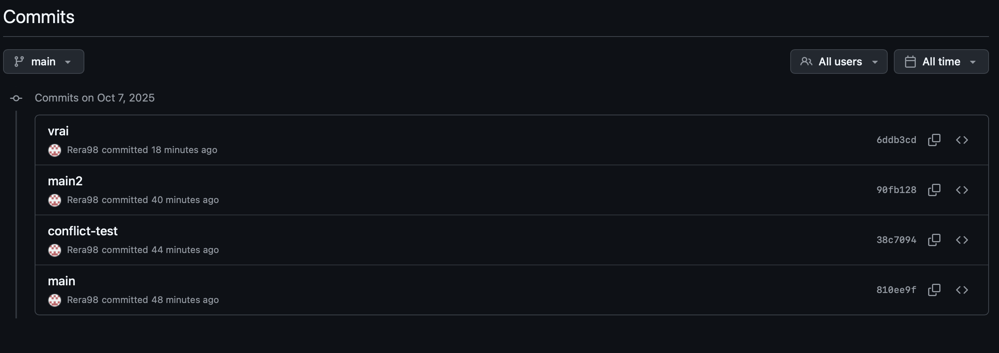

## Objectifs atteints

1. Manipulation de l'outil gh avec:
   - creation d'un repo github
   - creation de nouvelle branche
   - merger deux branches
   - gestion de conflits

